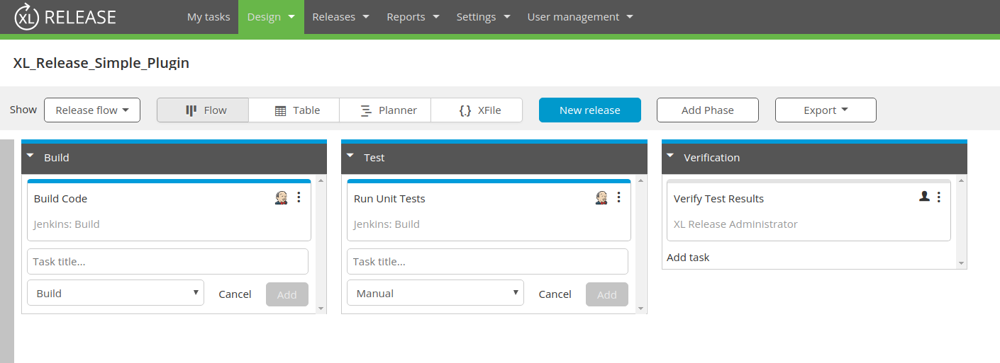

# XL Release Simple Plugin

## Problem Statement
Acme Corporation has a simple Build/Test/Verify template ([Template](templates/XL_Release_Simple_Plugin.xlr)):

They want to initiate this template when a commit to a git repository is pushed and then tag that release with the sha1 of that git commit.

In this exercise, set up the triggering mechanism to run a release with this template when a push to a git repository happens and tag it. Additionally, create a plugin with a custom automated task does the following:
- Sets the title of the release to include the sha1 of the commit before the build is executed.
